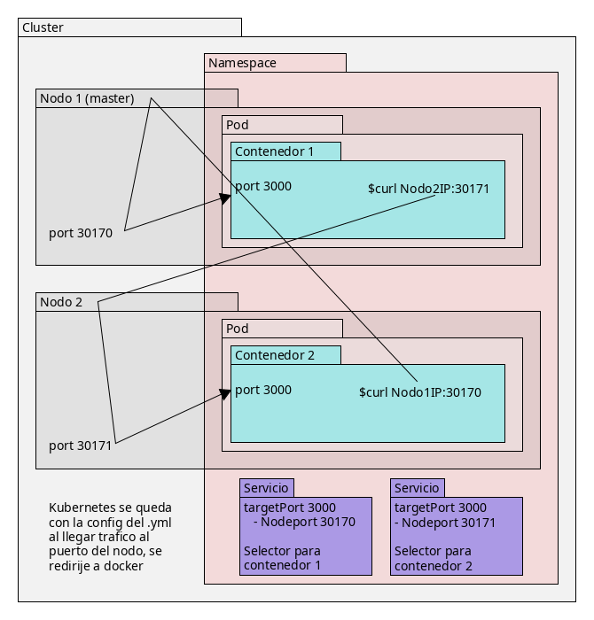
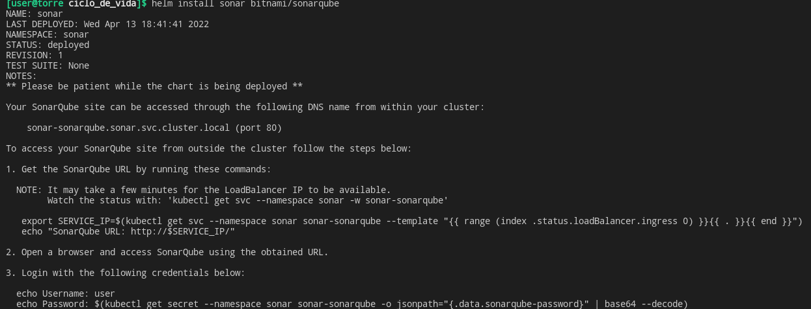

# Rutina de rearranque del cluster
`minikube start --profile cv1 --nodes 3 --driver docker --mount --mount-string /run/media/user/a7c45825-ded3-4acd-b0ef-61663dde6118/y2/documentos/academico/certs/ciclo_de_vida/storage:/persistent_volumes`

`minikube dashboard --profile cv1` o     
`minikube dashboard --profile cv1 > /dev/null 2>&1 &`
  Arrancar el dashboard, opcionalmente dejarlo en background y tirar su log.

Opcionales (-A para que muestre los de todos los namespaces)
`kubectl get nodes` 
`kubectl get pod -A -w` 
`kubectl get ing -A`

# Rutina de parada del cluster
1. Parar el dashboard `kill %1` o ctrl+c en el terminal en el que este
1. `minikube pause --profile cv1`
1. `minikube stop --profile cv1`

# Rutina de creacion del cluster
Dependencias: minikube y kubectl. Descargar con curl e instalar el binario para poder ejecutar con solo usar el nombre.

`mkdir storage`

`minikube delete --profile cv1`

`minikube start --profile cv1 --driver docker --nodes 3 --mount --mount-string /run/media/user/a7c45825-ded3-4acd-b0ef-61663dde6118/y2/documentos/academico/certs/ciclo_de_vida/storage:/persistent_volumes`  
  Es necesario usar el path absoluto a la carpeta del shot

`kubectl get nodes`

`minikube addons enable ingress --profile cv1`  
  Ingress es la puerta de entrada a las peticiones externas al cluster 

`minikube dashboard --profile cv1`


# Configuracion general
Si no resuelve las direcciones (`http://gogs.local` en el navegador). Editar `/etc/nsswitch.conf` y mover el orden, para que files este delante de todos los dns `hosts: mymachines files mdns4_minimal [NOTFOUND=return] resolve [!UNAVAIL=return] myhostname dns`.

## Hosts
`sudo vim /etc/hosts`
```
172.17.0.2    gogs.local
172.17.0.2    jenkins.local
172.17.0.2    artifactory.local
172.17.0.2    sonar.local
```


# Gogs
## Configuracion Gogs del cluser
`kubectl create namespace gogs`   

`kubectl config set-context cv1 --namespace gogs`   
  Hacer que gogs sea el namespace default para la sesion de kubectl del cluster cv1, para no tener que especificar el namespace del contexto durante los siguientes comandos  

`kubectl apply -f gogs/pv-gogs.yml`
  - api: Todos los .yml de config de kubernetes hay que poner api (coger la que den en el ejemplo de)
  - kind: dice lo que vas a definir en el .yml, podría ser un servicio, pod, despliegue, o en este caso, almacenamiento
  - spec: especifico al kind, este, como es espacio, se le pone una cantidad maxima
    - hostPath: el path en el nodo 
    - claimRef: en el PV se especifica el nombre del PVC que puede reclamar ese almacenamiento

`kubectl apply -f gogs/pvc-gogs.yml`  
  Ver la seccion de volumenes de los apuntes

`kubectl apply -f gogs/dep-gogs.yml`
  - version de api y tipo de .yml
  - metadatos, necesarios para que a la hora de aplicar la plantilla, se haga sobre este deployment
  - spec
    - matchLabel: asociar todo lo que este abajo con el selector, que exige que haya el mismo nombre en lo de abajo que en el metadata. Por si hubiera varios deployments en el mismo namespace
    - replicas: numero de pods clonados
    - template: las cosas que habra en cada pod: un solo contenedor y un volumen.
      - Todos van a tener el mismo label
      - Un volumen, que hay que reclamar y que se llamara data
      - Un contenedor, que se trae la ultima imagen de gogs y usa un nombre data para el almacenamiento, que lo casa con el volumen data. Seria util para varios contendores, donde cada uno tendria su propio volumen, o falta de el.    

`kubectl apply -f gogs/svc-gogs.yml` (svc de servicio)    
  Hacer el contenedor accesible desde otros namespaces. El contenedor esta publicando gogs en el puerto 3000, pero depende de la IP de este contenedor y de la del nodo. En el .yml mapea el puerto 3000, donde esta expuesto gogs, al puerto 3001

`kubectl apply -f gogs/ing-gogs.yml`

## Instalacion de gogs 
### Ajustes de instalacion
Database Settings
```
database type: sqlite3
path: data/gogs.db
```

Application General Settings
```
application url: http://gogs.local
```

Optional Settings > Admin Account Settings
```
Username: ayydmin 
Password: Ayydmin-01
Admin Email: a@a.com
```

### Deshabilitar Register link
Para que no pueda llegar cualquiera y registrarse. Editar `storage/pvc-gogs/gogs/conf/app.ini` y editar/añadir las siguientes lineas
```
DISABLE_REGISTRATION   = true
SHOW_REGISTRATION_BUTTON = false
```
Con los cambios hechos, parar y reiniciar la aplicacion. En kubernetes, matar el pod y volverlo a levantar. Despues de matarlo, kubernetes vuelve a levantarlo solo.  

`kubectl get pods -A`   
  Para ver los pods   

`kubectl delete pod dep-gogs-64bc668448-7q8qk --namespace gogs`
  Para borrar. La sal cambiara, de ahi tener que verlos

### Administracion manual de usuarios
1. Login como admin
1. User Profile > Admin Panel > Users > Create New Account
```
Username: user1
Email: b@b.com
Password: User-01
```

# Jenkins
`kubectl create namespace jenkins`
  Crear un namespace es independiente del namespace en el que estes.
`kubectl config set-context cv1 --namespace jenkins`

## Configurar la imagen 
La imagen base jenkins/jenkins:lts-slim solo tiene jenkins  
hay que añadir maven, node, etc en ese docker.

`pushd jenkins/jenkins-local`   
  Dockerfile que se baja la ultima version de jenkins, blueocean, maven, curl y docker.   

`docker build -t jenkins-local:latest .`    

`minikube image load --profile cv1 jenkins-local:latest`   
  Copia del repo de imagenes de docker jenkins-local a los repos de los tres nodos. Se puede comprobar con `minikube ssh --profile cv1 --node cv1-m02` y dentro del bash `docker images`. Si no se especifica nodo, entra en el maestro.

### Alternativamente
`minikube image build --profile cv1 -t jenkins-local:latest ./jenkins/jenkins-local`


## Problemas de usuarios
El contenedor de jenkins parte del usuario 1000:1000, si el que ha creado la carpeta en el host es un usuario distinto, la carpeta pv-jenkins le tendra de propietario. Para dejar al usuario de jenkins es necesario `chown -R 1000:1000 storage/pvc-jenkins`. O en el deploy cambiar las especificaciones `fsFroup` y `runAsUser` a los mismos del del host.

## Configurar jenkins del cluser
`kubectl apply -f jenkins/pv-jenkins.yml`
  Hay dos PV porque hay dos carpetas que interesa sean persistentes: el home de jenkins y el repo de maven (para que no se baje las librerias que necesita para compilar cada vez que se reinicie el pod)

`kubectl apply -f jenkins/pvc-jenkins.yml`

`kubectl apply -f jenkins/sac-jenkins.yml`
  Tiene tres sub-yaml: 
   - Crea una cuenta de servicio (permite acceso al cluster, superar la autenticacion para entrar y poder ejecutar comandos)
   - RBAC = Role Based Access Control: las idenditades estan separadas de los roles, por un lado se confirman las identidades y por otro lado las autorizaciones, lo que se le permite a cada identidad. En este caso estan basadas en roles. Si una identidad tiene un rol determinado, se garantiza que determinadas acciones (verbs: create, get, list, etc)  sobre determinados recursos (resources: pods, pods/log, etc) son posibles.    
  El yaml crea el rol rol-jenkins y varias relaciones de recursos y verbos para el rol, que recibira la identidad que lo tenga.
  - RoleBinding: Lista de cuentas a las que se les asocia el rol. Puede haber mas sujetos, aqui solo hay uno, pero para añadir otro solo hay que poner el guion, kind y demas del nuevo.

`kubectl apply -f jenkins/dep-jenkins.yml`
  - Se le especifica el securityContext, con el usuario y grupo. Es la cuenta con la que va a correr el proceso jenkins dentro del contenedor
  - Se trae la imagen de `/library/jenkins-local:latest`, la que hemos creado, y con imagePullPolicy a never para que nunca busque fuera.
  - Healthchecks: hay res tipos de probe declarados dentro del contenedor. COmprueban que se esta ejecutando bien haciendo una peticion http a /login, a ver si jenkins les responde con un 200. 
  - Resources limita los que recibe el pod, al arranque y limite.

  `kubectl apply -f jenkins/svc-jenkins.yml`
    Asocia los puertos de los contenedores en el pod al nodo. Al no especificar puerto, kubernetes te dara el que este disponible del rango de 30 000. Los puertos de los contenedores son 8080 y 50 000, los dos son para jenkins, uno es http y el otro jnlp.

`kubectl apply -f jenkins/ing-jenkins.yml`

## Instalar Jenkins
Al arrancar pide un token, se puede ver en el log

Instalar los plugins que quiera

Admin User:
```
Username: ayydmin 
Password: Ayydmin-01
Full name:
Email: a@a.com
```

# Artifactory del cluster
`kubectl create namespace artifactory`  
`kubectl config set-context cv1 --namespace artifactory`  

Instalar artifactory con helm:
https://artifacthub.io/packages/helm/jfrog/artifactory-oss 

`helm repo add jfrog https://charts.jfrog.io`
  Añadir el repo a helm

`helm repo update`
  Actualizar la lista local de paquetes de helm

`helm template -n artifactory artifactory --output-dir ./artifactory jfrog/artifactory-oss`
  - `template`: bajarse el chart a local
  - `-n artifactory`: el namespace para el que esta hecho
  - `artifactory`: el nombre de la release, para etiquetar lo que estas desplegando
  - `--output-dir ./artifactory` el directorio raiz del que colgara la estructura de la template. Si no se especifica, genera la template como un unico archivo.
  - `jfrog/artifactory-oss` el chart a partir del cual generar la template

Dos opciones para cambiar la configuracion base
  - Recorrerse el arbol leyendo cada yaml (para lo que sirve el template)
  - Dejarlo correr, ver lo que ha montado, y editar los yaml especificos que se quieran cambiar (luego aplicarlos, actualizandolos)

Tras ver los yaml, hay dos pods (statefulset, pods con estado) que van a necesitar volumenes persistentes: artifactory-postgre y artifactory-artifactory. Van a necesitar carpetas con permisos adecuados. Los uid y gid que usan estan declarados en sus yaml correspondientes.
```
mkdir -p storage/pvc-artifactory/{postgre,artifactory}
chown 1001:1001 storage/pvc-artifactory/postgre
chmod 777 storage/pvc-artifactory/postgre
chown 1030:1030 storage/pvc-artifactory/artifactory
chmod 777 storage/pvc-artifactory/artifactory
```

`kubectl apply -f artifactory/pv-artifactory-postgre.yml`   
  Hay que crear un volumen persistente. El nombre del claim es `data-artifactory-postgresql-0`
   - `data` es el nombre del volumen claim que hara postgre
   - `artifactory-postgresql` es el nombre del statefulset (pod con estado) que va ha pedirlo
   - `0` el identificador de statefulset de entre las replicas que haya

`kubectl apply -f artifactory/pv-artifactory-artifactory.yml`
  El mismo comando, pero con distinto nombre y tamaño limite de carpeta.

`helm install -n artifactory artifactory jfrog/artifactory-oss --set artifactory.postgresql.postgresqlPassword=Postgre-p4ssword`
  Se puede ver en el yaml que el cambiado de contraseña no esta hardcoded al script, sino que crea un secreto de kubernetes. Ahora es un buen momento para cambiarlo. Como por lo demas los valores de los atributos que hemos visto en el template eran validos, no hay que cambiar mas cosas.

`kubectl apply -f artifactory/ing-artifactory.yml`

## Configuracion de Artifactory
Los credenciales predefinidos para poder entrar la primera vez son:
```
Username: admin
Password: password
```
Te obliga a cambiar la contraseña y url
```
New Password: Ayydmin-01
Base URL: http://artifactory.local
```

# Sonarqube
`kubectl create namespace sonar`  
`kubectl config set-context cv1 --namespace sonar`  

`helm repo add bitnami https://charts.bitnami.com/bitnami`    
  Añadir el repo de bitnami

`helm repo update`
  Actualizar la lista local de paquetes de helm

`helm template sonar --output-dir ./sonar bitnami/sonarqube`
  Revisar manualmente los yml y sus necesidades. 

Postgre necesita un volumen persistente accesible al usuario 1001 del grupo 1001. Tiene que tener el namespace sonar, la direccion de la carpeta, y el nombre del reclamante <nombre del template de pvc (data)>-<nombre del stateful o deployment (sonar-postresql)>-<identificador del stateful (0)>

Sonar necesita tambien un volumen persistente, y tiene el mismo uid y gid

```
chmod 777 storage/pvc-sonarqube/postgre
chown 1001:1001 storage/pvc-sonarqube/postgre
chmod 777 storage/pvc-sonarqube/sonarqube
chown 1001:1001 storage/pvc-sonarqube/sonarqube
```

`kubectl apply -f sonar/pv-postgresql.yml`

`kubectl apply -f sonar/pv-sonarqube.yml`

`helm install sonar bitnami/sonarqube`

- La contraseña esta guardada en Secrets > sonar-sonarqube > Data
Password: x8o2XeSrOB

`kubectl apply -f sonar/ing-sonarqube.yml`
Como dice en la imagen, se puede ver el usuario y el secreto para la contraseña (aun despues de cambiarlo) con los siguientes echo:
```
echo Username: user
echo Password: $(kubectl get secret --namespace sonar sonar-sonarqube -o jsonpath="{.data.sonarqube-password}" | base64 --decode)
```