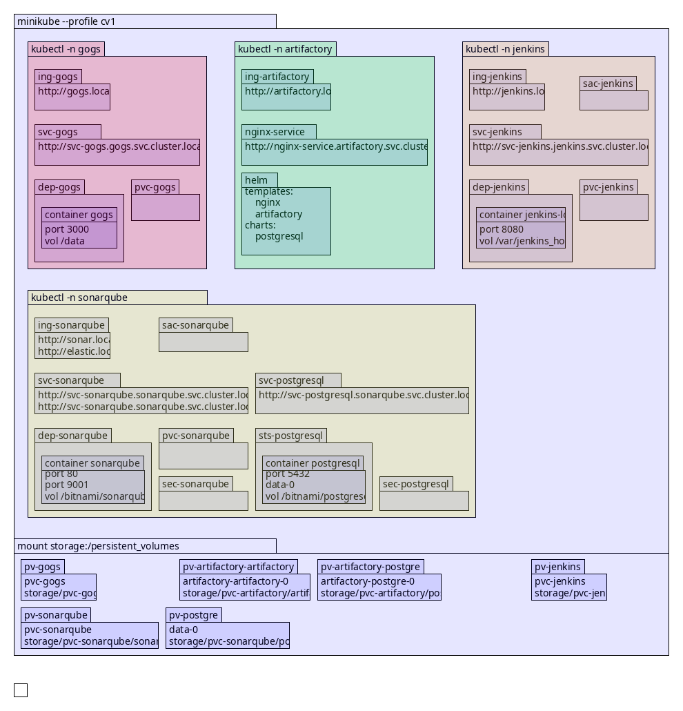
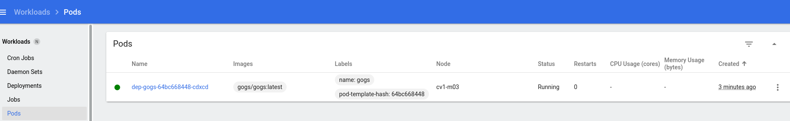
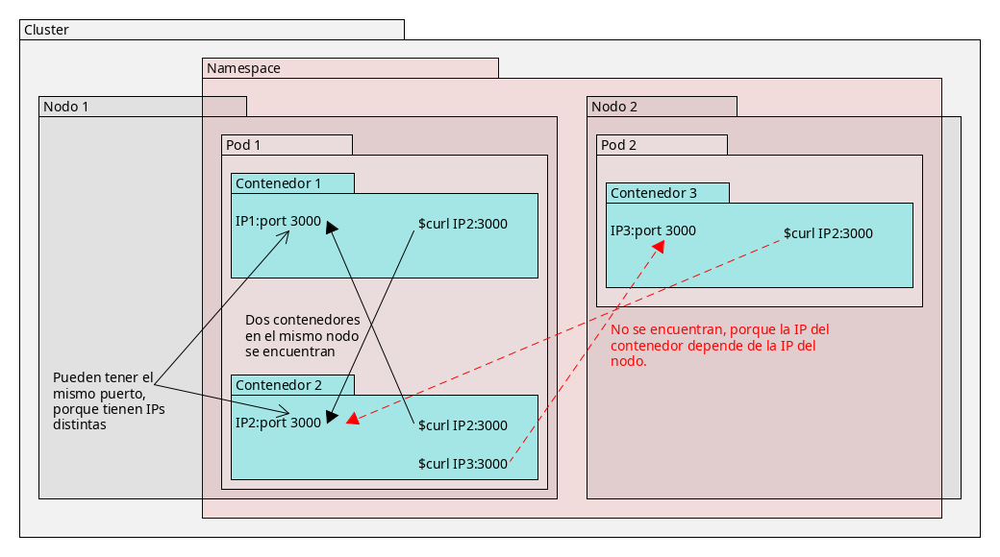
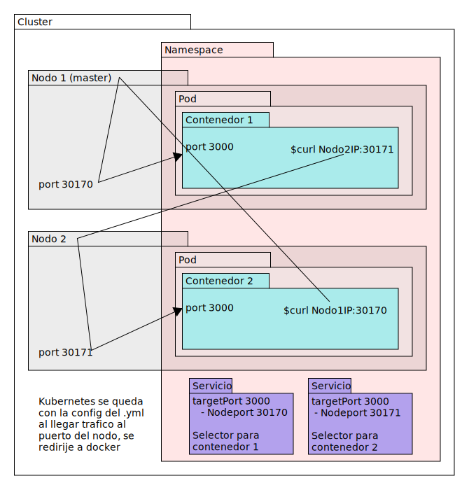
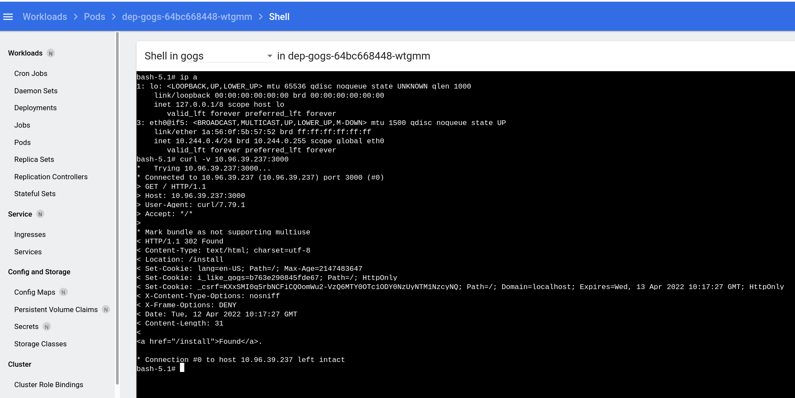

# Definiciones generales
<b>Sal</b>: añadir a un nombre que es fijo una parte que lo diferencia, de manera algoritmica.

<b>MiliCPU</b>: La unidad de medida de consumo de recursos de CPU de cada pod. Tanto para CPU como para GPU se pueden asignar rangos

<b>Cluster</b>: El conjunto de todos los elementos que trabajan de forma combinada y que comparten algo (eg definiciones, hardware). Permite alta disponibilidad.
  - Su configuracion no se hace de manera manual, sino con manifiestos

<b>Pod</b>: La unidad básica de kubernetes. Un conjunto de contenedores en ejecucion, que arrancan como un todo. Cada contenedortiene su propia configuracion y puede tener su propio volumen.
  - Todos los contenedores de un pod se ejecutan en un mismo nodo
  - Configurado por YAMLs al arrancar

<b>YAML</b>: lenguaje declarativo. Permite tener un fichero con los las declaraciones de configuraciones de recursos en un cluster (todos los elementos).
  - Permite tener una copia de la configuracion de un pod
  - Fungibles, solo se usan para configurar al arrancar, no se guardan copias de ellos en los elementos en ejecucion

<b>Helm</b>: un manejador de paquetes para kubernetes. Los paquetes se llaman "charts". Cada chart es el conjunto de informacion equivalente al conjunto de yamls necesarios para crear una aplicacion kubernetes. Tiene tres formas principales de configurarlo:
  - `install` aplica el chart a kubernetes directamente. Admite dos tipos de modificaciones: meter por linea de comandos el atributo y el valor; o usar un yaml con los atributos que tiene que sobreescribir. El orden en el que se aplican los valores a los atributos son: los que vinieran con el chart; luego los del yaml de settings, y finalmente los que se pongan en el comando
  - `template` baja el chart a local antes de aplicar, deja editarlo.

<b>Service</b>: Tipo (kind) de .yml para definir un elemento en un cluster. Es una definicion, un manifiesto, no algo activo. Asocia un puerto a otro siempre que se cumpla el selector.
  - No son parte del pod ni del nodo, son configuraciones del namespace

<b>Dockerfile</b>: Archivo con el conjunto de pasos para crear una imagen de docker.

<b>Bitnami</b>: empresa dedicada a crear charts para helm a partir de aplicaciones, suyas o de terceros.
<b></b>
<b></b>
<b></b>

# Herramientas
## Minikube
Es una utilidad que construye clusters de kubernetes usando docker. Puede levantar nodos o gestionadores.

Un cluster de kubernetes se puede clasificar por namespace. El namespace permite aislar unos elementos respecto a otros dentro del mismo cluster.

Los nodos del cluster son las unidades fisicas sobre las que esta corriendo las Us en un rack. Aqui simulamos las Us con docker.
`minikube --profile cv1` se baja las imagenes necesarias para el cluster, el manager y el node.

<!--  -->

## Dashboard
Se puede ver el log en Dashboard >Workloads >Pods >[pod_especifico] >menu 3 puntos >logs

- Lista de imagenes usada por los contenedores del pod
- Nodo en el que ha caido la ejecucion del pod  

## Gogs
Repositorio de codigo, alternativa a GitHub, GitLab, Azure Repos, pero mas ligero que ellos. El punto de entrada del codigo al ciclo de vida. Para desarrollo

## Jenkins
El motor que transforma bits de fuentes a bits de binarios. Tambien lo usaremos para pasar los binarios a contenedores en kubernetes (construir la imagen del contenedor, pasarla a kubernetes, y desplegarla).

## Artifactory
Repositorio de binarios

# Volumenes persistentes
## Evolucion de la persistencia
1. Docker y volumenes: mapear una carpeta en el host a una carpeta en el contenedor

1. Darle un nombre (independiente de direccion) a la carpeta en el host y montar la carpeta del contenedor contra ese nombre. Permite gestionar los volumenes de manera independiente a los contenedores. Independiente => no tener que cambiar la direccion del host en el comando para correr el contenedor o el docker-compose. Con mover la etiqueta en el host, la mueves para todos los contenedores.   

1. Aqui acaba docker. Siguiente paso es para kubernetes, en nuestro caso, con tres Us, los contenedores pueden volar de una a otra, pero necesitan llevarse la persistencia con ellos. Para resolverlo se usan los drivers de almacenamiento. Una solucion es tener el almacenamiento en una NFS que sirva por red. Pero es mas lento, y tiene cuellos de botella de red. Para nuestr ocluster, como esta montado sobre contenedores, la solucoin ha sido montar un volumen comun a todos los nodos. Carpeta original es /storage, mapeada a /persistent_volumes en cada contenedor.

1. Todas las Us conocen todos los namespaces, lo que baila entre Us son los contenedores. Los namespaces pueden tener uno o mas contenedores, que se gestionan con manifiestos. Una vez que las Us o contenedores tienen magicamente el volumen en local (tras el paso 3), van a tener que crear contenedores, y resolver el almacenamiento del nuevo contenedor a una carpeta en la persistencia original. Con /persistent_volumes en cada nodo, hay que trocear los contenidos

## En nuestro sistema
Los manifiestos (.yml) no dependen del cluster en el que se ejecutan, por lo que tiene que haber algo que les asocie el almacenamiento.

PVC = Persistent Volume Claim: reclamacion de almacenamiento, punto intermedio. Permite que los contenedores no esten asociados a definiciones de volumenes del cluster. Es la que va con el namespace. No sabe donde esta el almacenamiento. Es un nombre y varios settings que tienen que coincidir con el PV. 

El PV es el que sabe donde esta el almacenamiento en el nodo, tiene un path en el nodo y un nombre de PVC que puede reclamarlo.

# Puertos y acceso a contenedores 

En muchos casos no se asignan los puertos a mano, se deja sin definir para que el sistema lo resuelva por su cuenta.

Los nodos en un mismo pod comparten subred y pueden verse. En lugar de usar la IP del contenedor, que cambia a menudo, se puede usar    
`http://<nombre-contenedor>:<puerto>`    
Las IPs de los contenedores son unicas en el nodo, pero no en el cluster.

## Nodeport

Las redes estan montadas con NAT, rangos de IPs para subredes. Cada nodo tiene su propia IP, y un docker con contenedores corriendo, cada contenedor con su propia IP en el rango de IPs que les de la ejecucion de docker. Los contenedores en una misma ejecucion de docker estan en el mismo rango de IPs, y pueden verse. Los contenedores de dos ejecuciones de docker en un mismo nodo no pueden verse entre si (directamente).

En el .yml de servicio se declara (con guion port y targetport, podrian tener el orden al reves) port (el puerto del cluster) y targetPort (el puerto de todos los contenedores que cumplan el selector (tener el nombre gogs)).

Cuando queremos acceder a un contenedor, se conecta con la IP del nodo, y por NAT se resuelve el puerto del nodo al del contenedor especifico.

En Nodeport hay que saber el nodo en el que esta corriendo el contenedor y la IP del nodo.

## ClusterIP
En ClusterIP se asignan IPs a nivel de cluster, haciendo los contenedores independientes del nodo en el que esten ejecutandose. Hay un proxy (kubeproxy) a nivel de cluster y otro en cada nodo, cuando llega trafico al contenedor, el proxy de este lo redirige al nodo apropiado, y el proxy del nodo al contenedor que sea.

En esta imagen el se muestera un curl desde el contenedor (IP de la ejecucion de docker del nodo en el que este) al proxy del cluster (ClusterIP, IP a nivel de cluster, para nodos y los contenedores que usen ClusterIP), que ha redirigido la llamada al proxy del nodo, que la ha redirigido de vuelta al contenedor. Este se ha respondido a si mismo.

## LoadBalancer
Kubernetes puede hablar con un balanceador de carga para recibir la IP que le de este. Kubernetes facilita al balanceador un camnio para hablar con los pod, y luego le pide pods disponibles para llevarse el trafico.

# Estos son independientes de clusterIP y nodeport
## URLs 
URL esta disponible en cuanto publicas un servicio, no tiene que tener ClusterIP. 

No tiene sentido trabajar con direcciones en un entorno donde son tan volatiles, se usan URLs internas, que se resuelven a la direccion solas.    
`http://<nombre-servicio>.<namespace>.svc.cluster.local:<puerto>`     
Sirve para acceder a cualquier a nivel de cluster, sea un nodo o un contenedor que se haya declarado como un servicio. El siguiente comando consigue el mismo resultado que el curl de la imagen anterior.    
`curl -v http://svc-gogs.gogs.svc.cluser.local:3000`     

## Istio
Sirve para usar URLs menos farragosas. Trabaja a nivel de namespace. Añade un sidecar a cada contenedor que controla. Los contenedores solo hablan con el sidecar, que se encarga de enrutar las peticiones. Tambien hace balanceo de carga, redirigiendo peticiones de forma inteligente. Permite despliegues canary, donde mantienes la version antigua de un servicio y la nueva, y rediriges un pequeño porcentaje del trafico a la version nueva, sin perder la anterior.

## Acceso externo: Ingress
Es una imagen docker con un nginx. El nginx queda publicado en el puerto 80 de la direccion publica del cluster. Segun el dominio (hostname) con el que se entre a la ip, reenvia la peticion al servicio (por nombre de servicio y puerto) que tenga asociado el pod adecuado.

Se pueden tambien filtrar los endpoints del hostname, segun el / del que cuelque la peticion.

